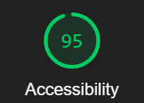

# cookie-stand

A proof of concept application to calculate the number of cookies each location must make every day so that it can manage its supplies inventory and baking schedule.

## Lighthouse

